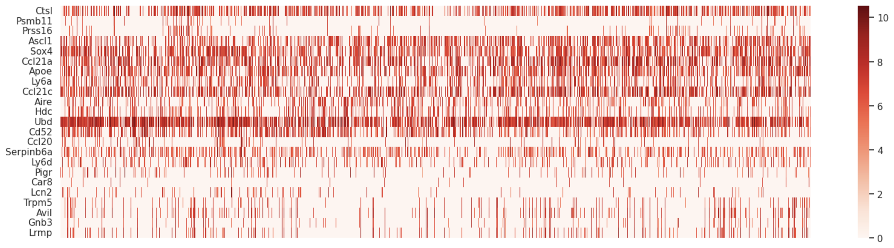
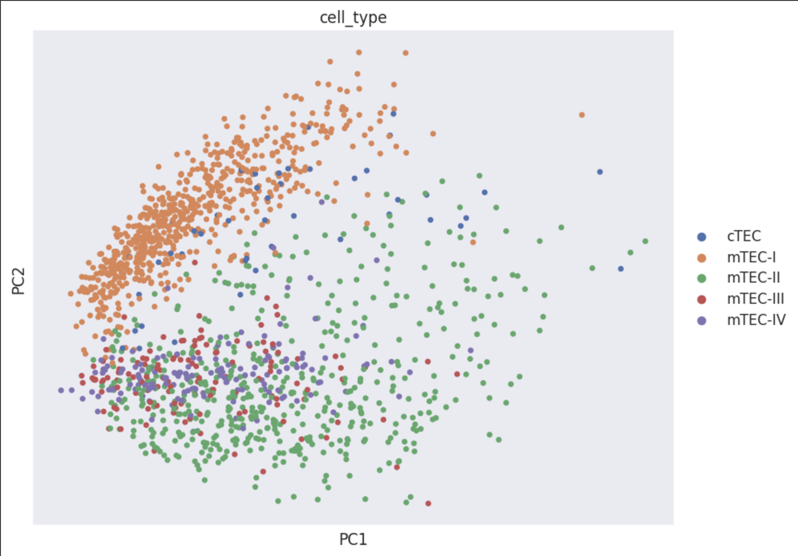
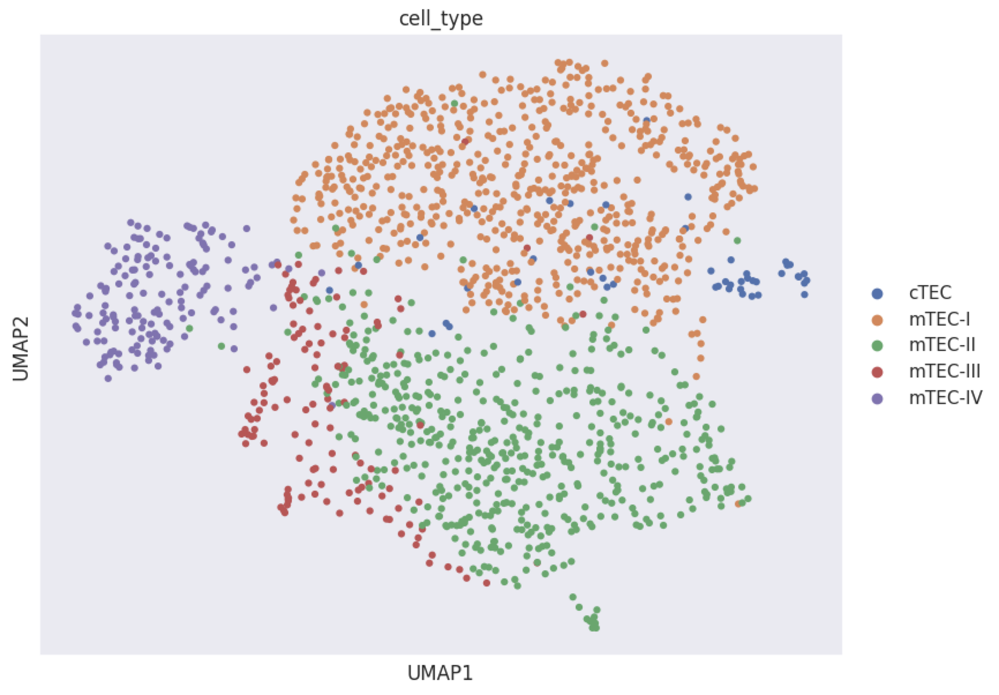
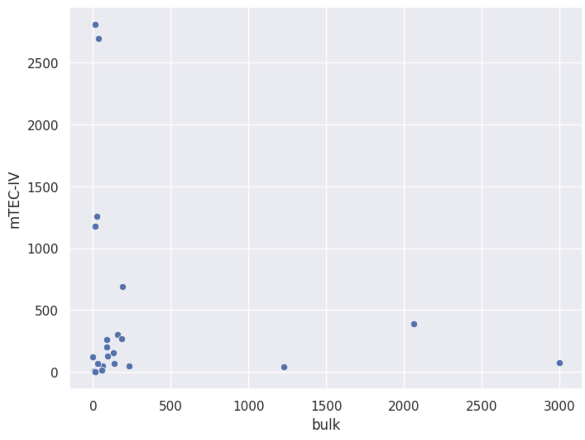
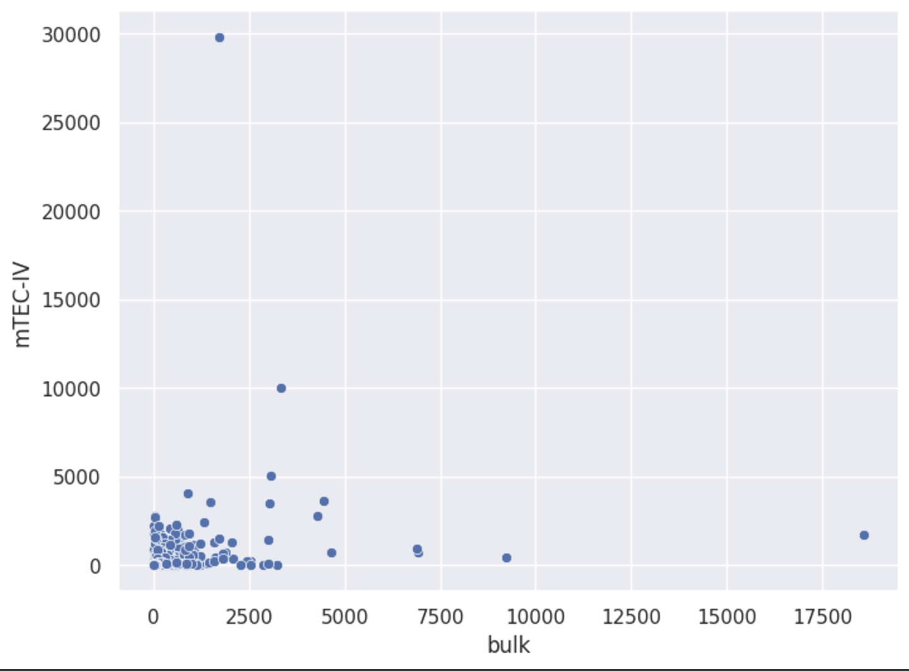
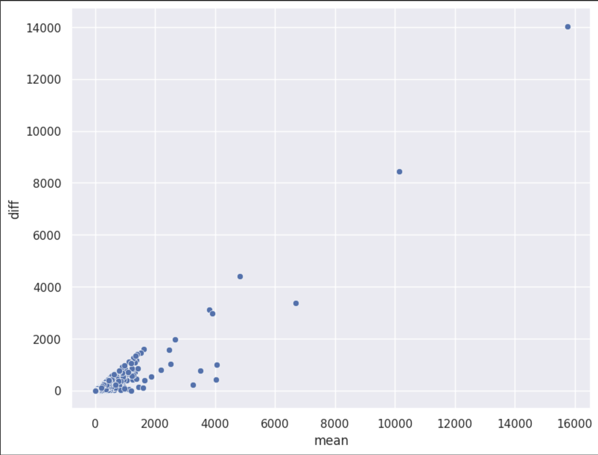
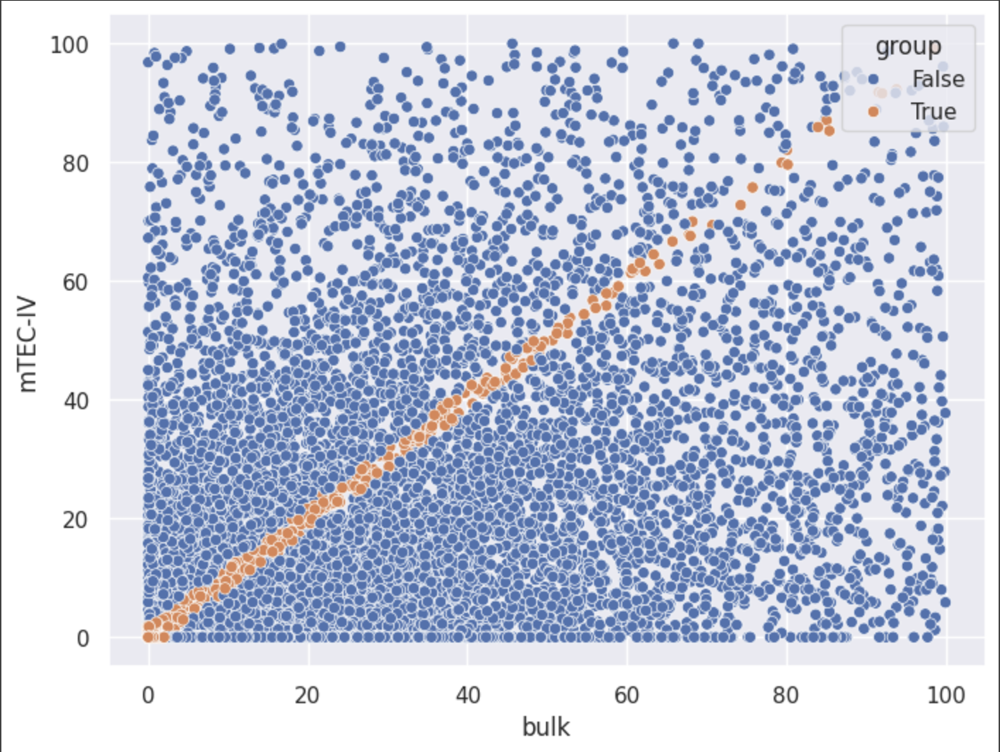

# hse24_hw5

```Выполнил: Иванов Георгий Ярославович ``` \
```Группа: БПИ223```

[Ссылка на колаб](https://colab.research.google.com/drive/1mwPq0rNPE6K3troA0Z07LsZNA58-PG8_?usp=sharing)

Перед построением графиков данные были нормализованы методом RPM.

## Heatmap:



## UMAP и PCA




## Бонусная часть 




